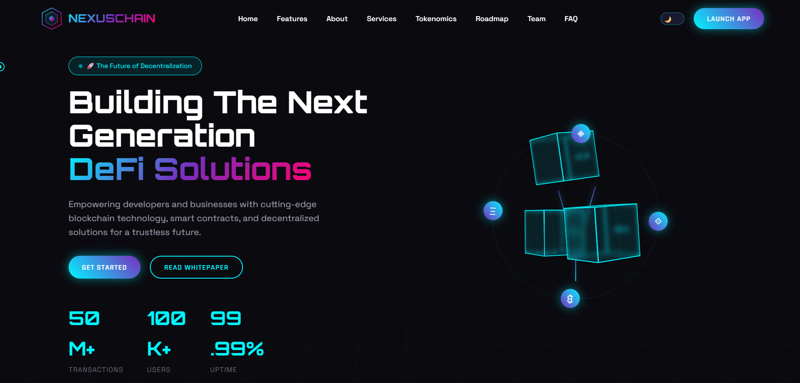

# 🌐 Omkar R. Ghare — CryptoZen Web3 Landing Page (v1)

A modern and minimal **Web3 & Blockchain startup landing page** built to showcase futuristic UI design and responsive front-end development skills.

This project demonstrates my ability to create clean layouts, smooth animations, and startup-ready web interfaces using core web technologies.

---

## 🚀 Live Demo  
🔗 https://omkarghare8.github.io/web3-blockchain-landing-page-template-v1/

---

## ✨ Features

- Clean and minimal Web3 UI  
- Fully responsive design  
- Smooth scrolling animations  
- Hero section with CTA  
- About & Features section  
- Tokenomics layout  
- Roadmap timeline  
- Team & FAQ section  
- Modern footer design  

---

## 🛠 Tech Stack

- **HTML5** – Structure  
- **CSS3** – Styling and layout  
- **JavaScript** – Interactivity  
- Responsive design techniques  

---

## 📸 Preview

(Add a screenshot named **preview.png**)

---

## 🎯 Purpose of This Project

- Build startup landing pages  
- Create modern Web3 UI  
- Develop structured front-end projects  
- Design responsive blockchain templates  

---

## 👨‍💻 Author

**Omkar R. Ghare**  
Front-End Developer  

---

## 📌 Note

Created for portfolio showcasing and internship opportunities.
